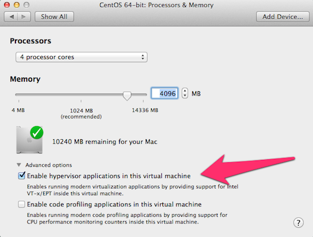

A fast, incremental image builder based on qemu-img, scons, and chroot.  Kinda like `docker build`,
except it creates VM images.

## How does it work?

Images are composed of layers.  Each layer is written to a qcow2 snapshot which is "backed" by the
previous layer.  The final image is produced by flattening the snapshot chain into a single file.
Each layer is cached for reuse based on the checksum of input files.

You can create branches of the source and switch around between them.  Because the cache is
checksum-based, layers will only be built if their inputs haven't been built before.

## Why a layer based image builder?

Say you'll be maintaining a VM image, which you expect to update periodically.  Consider your
options for managing the image:

* Automate a build from on the base OS (eg, packer or kickstart):  On the plus side, changes are
tracked in source code.  But every change requires a full build, which can be slow.  Even
worse, the build isn't repeatable -- OS packages change over time, so any build might
pull in a new package that breaks something.  Yes, this does happen in practice!  

* Modify your image manually, and release snapshots:  A convenient approach, and changes are
predictable, but the build steps aren't recorded.  It's difficult to rebuild a pristine image, or
produce a changelog, or manage different branches, or figure out what change broke something...

* vm-layer-builder:  Convenient, repeatable, with changes tracked in code.  For each change, you have
a choice between a quick incremental (add a new layer) or a full rebuild (modify the base layer).
Incremental changes can be periodically "rolled up" into a base layer.

## Usage
 
The base image is defined in `SConstruct` (for the time being).  Download it into the working copy.
  
The script looks for folders with names matching \d\d_name, with a `build-layer` script inside.  New
layer folders can be created with `./bin/new-layer <layer-name>`.

During a build, the `build-layer` script is called in a chroot, with its folder mounted at /mnt.

To run a build:

`scons --nbd=/dev/nbd0`  (use an available nbd device)

Output will be at `build/image.qcow2`.

Do a test boot with qemu (non-descructive - filesystem changes are discarded): 

`./bin/test-boot`

Type `^a x` to exit out of the qemu environment. 

## Requirements

* `nbd` kernel module
* `qemu-img` (developed on 1.5.3 from CentOS 7)
* `scons` (developed on 2.3.0 from Centos 7)
* `cloud-utils`, specifically the `growpart` command
* password-less sudo access

The `test-boot` script additionally requires a VT-x capable host and qemu-kvm, with
bridge networking configured.

## Setting up a CentOS 7 vm-development-vm

VMWare is recommended because unlike Virtualbox, it supports VT-x in guests.

Install a CentOS vm from the minimal ISO.  Enable VT-X in the CPU settings:



... and create an admin account for yourself.  Use `sudo gpasswd -a $USER wheel` and `visudo` to
setup NOPASSWD sudo access.

Install mainline kernel, enable the nbd driver, and reboot:

```
sudo rpm -Uvh http://www.elrepo.org/elrepo-release-7.0-2.el7.elrepo.noarch.rpm
sudo yum -y --enablerepo=elrepo-kernel install kernel-ml

sudo grep menuentry.*elrepo.x86_64 /boot/grub2/grub.cfg
sudo vi /etc/sysconfig/grub
# update like GRUB_DEFAULT="CentOS Linux (4.3.3-1.el7.elrepo.x86_64) 7 (Core)"
sudo grub2-mkconfig -o /boot/grub2/grub.cfg

echo '#!/bin/sh
if [ ! -c /dev/nbd0 ] ; then
        exec /sbin/modprobe nbd max_part=63 >/dev/null 2>&1
fi
' | sudo tee /etc/sysconfig/modules/nbd.modules
sudo chmod +x /etc/sysconfig/modules/nbd.modules

reboot
```

Install other requirements:

```
sudo yum install -y qemu-img scons cloud-utils
```

Download the base image.  This needs to be done in the vm-layer-builder working copy.  You can mount the source in the VM using hgfs (see below), or install git and make a checkout in the VM.

```
sudo yum install -y wget
wget http://cloud.centos.org/centos/6/images/CentOS-6-x86_64-GenericCloud-1510.qcow2.xz
xz -d -k CentOS-6-x86_64-GenericCloud-1510.qcow2.xz
```

Optional: setup mDNS so you can ssh to the VM using `ssh vm-builder.local`:

```
sudo hostnamectl set-hostname vm-builder
sudo yum install -y avahi
sudo systemctl start avahi-daemon
sudo systemctl enable avahi-daemon
# fix slow DNS on ssh connection
echo "UseDNS no" | sudo tee -a /etc/ssh/sshd_config
sudo systemctl restart sshd
```

Optional: install vmware tools so shared folder mounts work (in /mnt/hgfs):

```
sudo yum --enablerepo=elrepo-kernel install kernel-ml-devel kernel-ml-headers
sudo yum install -y epel-release net-tools
sudo yum install -y dkms perl
sudo mkdir /mnt/cdrom
# choose Install VMWare Tools first in the UI
sudo mount /dev/sr0 /mnt/cdrom/
cd
tar zxvf /mnt/cdrom/VMwareTools-*.tar.gz 
cd vmware-tools-distrib/
sudo ./vmware-install.pl -f -d
```

Install qemu and setup bridge access (required for test-boot script)

```
sudo yum install -y qemu qemu-kvm bridge-utils
interface=$(cd /sys/class/net/ && ls -d en* | head -1)
sudo cp /etc/sysconfig/network-scripts/{ifcfg-$interface,ifcfg-br0}
sudo sed -i -e /UUID/d --e s/$interface/br0/ -e s/Ethernet/Bridge/ /etc/sysconfig/network-scripts/ifcfg-br0 
echo DELAY=0 | sudo tee -a /etc/sysconfig/network-scripts/ifcfg-br0
sudo sed -i -e /DEFROUTE/d -e /PEER/d -e /IPV4/d -e /IPV6/d -e 's/BOOTPROTO.*/BOOTPROTO=none/' /etc/sysconfig/network-scripts/ifcfg-$interface
echo BRIDGE=br0 | sudo tee -a /etc/sysconfig/network-scripts/ifcfg-$interface
sudo gpasswd -a $USER kvm
echo "allow br0" | sudo tee -a /etc/qemu-kvm/bridge.conf
sudo reboot
```

## Generating a cloud-localds image

cloud-localds test-boot/cloud-init.img test-boot/user-data.yaml test-boot/meta-data.yaml

virsh attach-device sfo2-dev-vmdev019.sfo2.zoosk.com cloud-disk.xml --config